# 区块链数字货币售后项目

# 简介

#### **新增产品手册：https://rwadocs.bnbcode.com/**


 **Flutter 跨平台原生**技术路线，从登录、行情、K 线、下单、结算到资产、充提，全部以原生页面重写。相比套壳方案，它带来三点确定性的差异：**启动更快、操作跟手、可正式上架应用商店**。

**TradFi（外汇 / 商品 / 股票 / 指数）**。

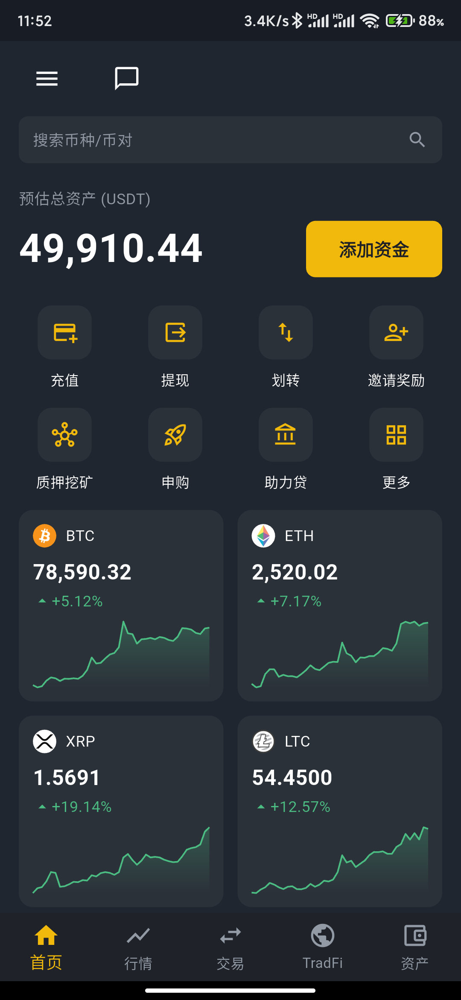

<sub>首页：资产总额、快捷入口宫格、热门币种走势卡片一屏直达。</sub>


### 一、交易核心：全部原生

- **行情与 K 线**：接入 **TradingView 专业图表**，多周期切换、指标齐全；行情价格实时推送，K 线顶部报价已做到秒级更新。

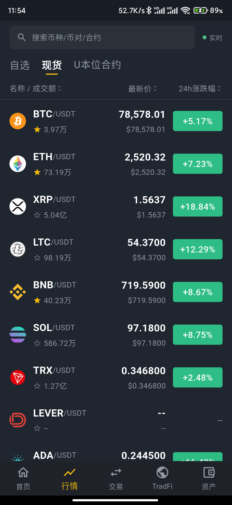&nbsp;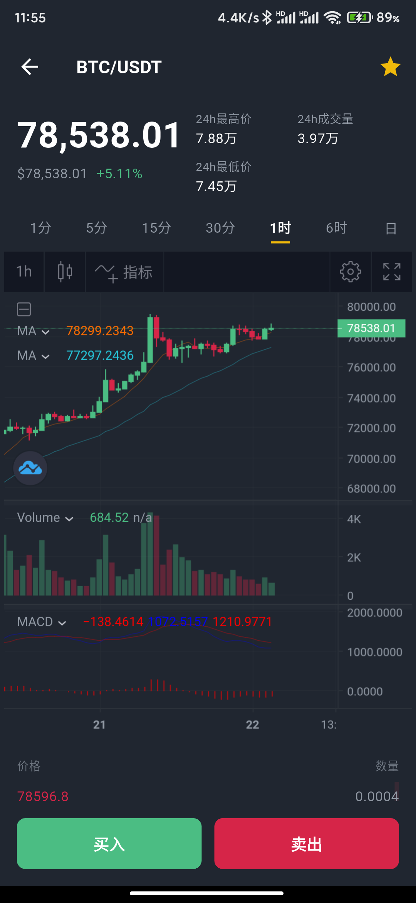

<sub>左：行情列表支持自选 / 现货 / U 本位合约分区，价格与涨跌幅实时刷新（右上角"实时"指示灯常亮）。右：TradingView 专业图表，7 档周期、MA / 成交量 / MACD 指标齐备，可全屏、可加指标。</sub>

- **秒合约**：下单 → 倒计时 → 自动结算，倒计时以服务端定盘时刻为唯一基准，所见即真实结算时点。

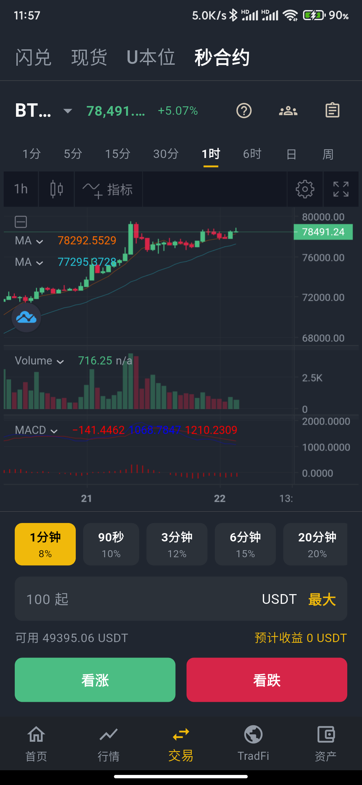

<sub>秒合约：专业图表 + 多档周期与收益率（1 分钟 / 90 秒 / 3 分钟 / 6 分钟 / 20 分钟），看涨看跌一键下单。</sub>

- **U 本位永续合约**：划转、开仓、持仓、平仓完整闭环，市价/限价、盘口十档、实时盈亏一屏可见。

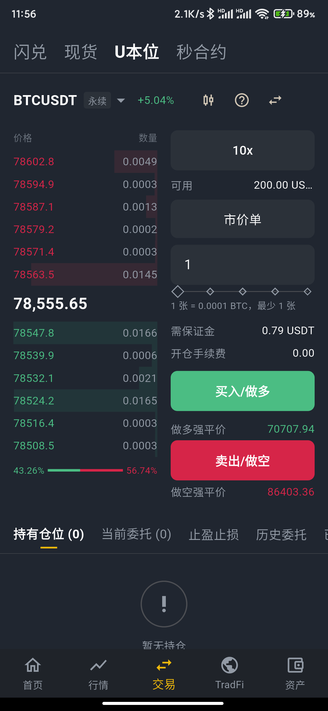

<sub>U 本位永续：左侧实时盘口与多空力量比，右侧杠杆倍数、保证金、开仓手续费、双向强平价全部实时测算后再下单。</sub>

- **币币现货 与 闪兑**：两种交易方式并行，适配不同习惯的用户。

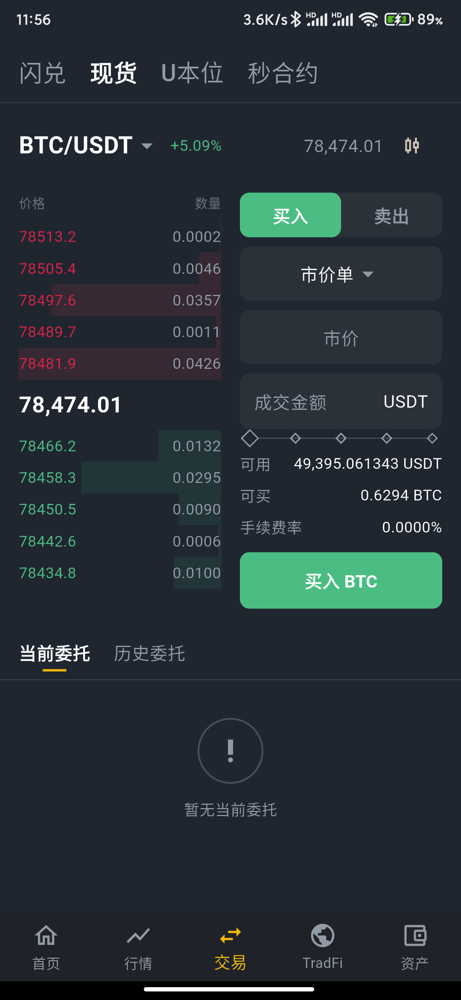

<sub>币币现货：盘口、市价/限价切换、可用与可买额度、手续费率一屏呈现，下方直接接当前委托与历史委托。</sub>

- **TradFi（外汇 / 商品 / 股票 / 指数）**：在传统金融品类上提供与数字资产一致的交易体验，行情页优先呈现，品类 Tab 可由平台后台自由配置。

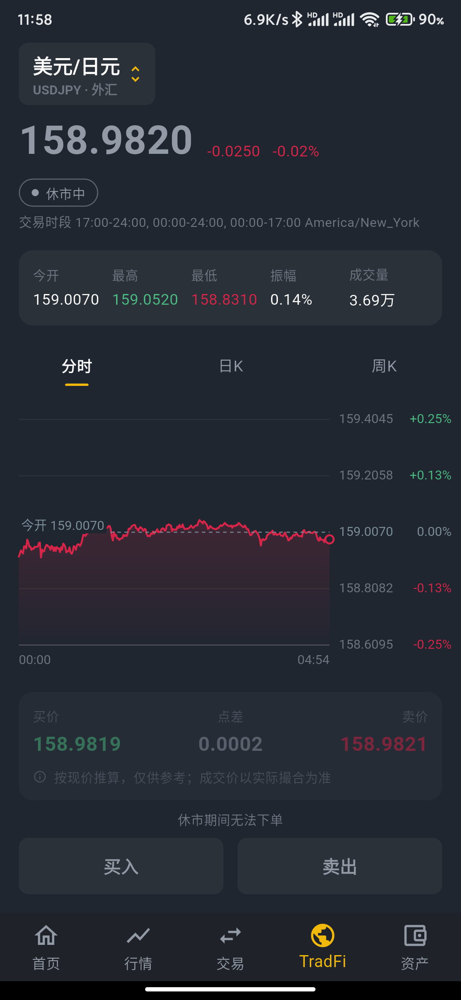&nbsp;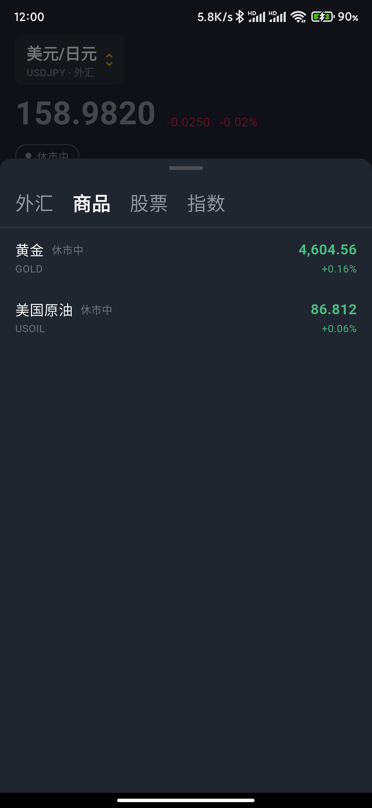

<sub>左：TradFi 品种页，今开 / 最高 / 最低 / 振幅 / 成交量、分时与日周 K、买卖价与点差齐全，并按品种真实交易时段显示开市状态（截图摄于周末，故显示"休市中"且下单按钮置灰——这正是交易时段风控生效的表现）。右：外汇 / 商品 / 股票 / 指数四大品类，品类与品种均由后台配置。</sub>

### 二、资产与资金

- 资产总览、**账户分布**（现货 / 合约 / 理财分账户一目了然）、划转、充值、提现、充提记录、资金流水，全部原生化。
- 充值页按币种正确标识 TRC20 / ERC20 / BEP20 等网络，从源头避免充错链。
- 资产页完整展示全部持仓币种，金额显示统一优化：去掉冗余小数位，同时保留小额资产精度。

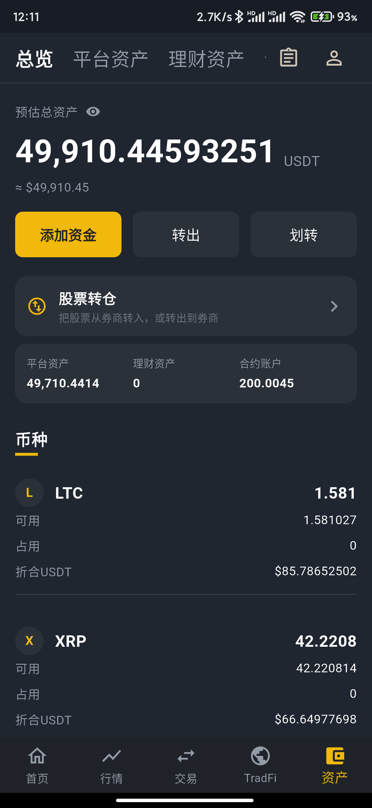&nbsp;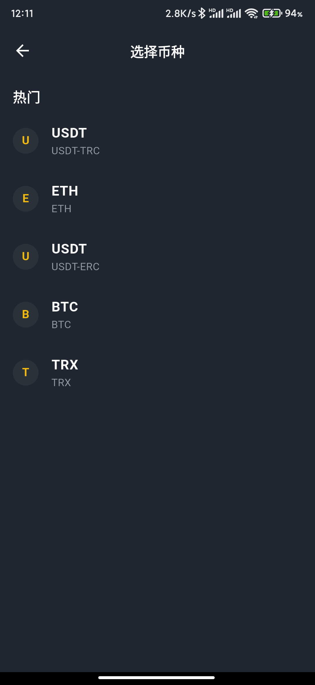&nbsp;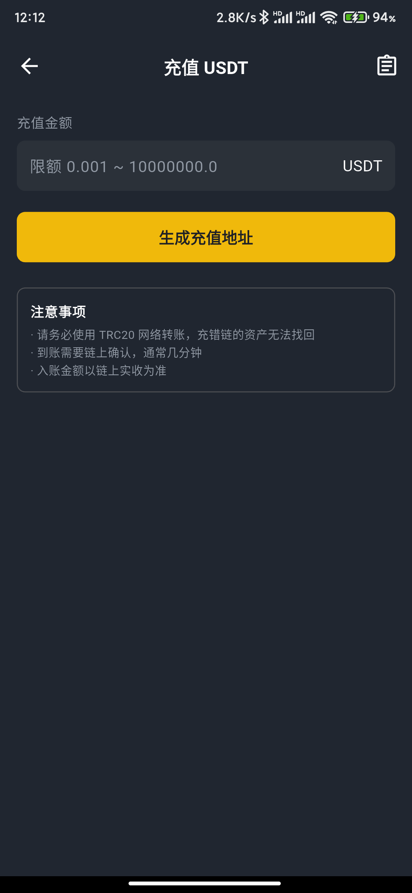

<sub>左：资产总览——预估总资产、平台 / 理财 / 合约三个账户分布，下方按币种列出可用与占用。中：充值选币种，同为 USDT 也明确区分 TRC 与 ERC 网络。右：充值页把"充错链无法找回"的风险提示前置到操作之前。</sub>

### 三、理财与增值

- **理财（三分区）/ 质押 / DeFi / 助力贷 / 挖矿** 全部原生页面。
- **申购（打新）**：项目列表、认购、订单与状态流转全流程原生。
- **跟单 / 带单**：输入跟单码一键跟投，带单员发码带单，全流程系统托管。

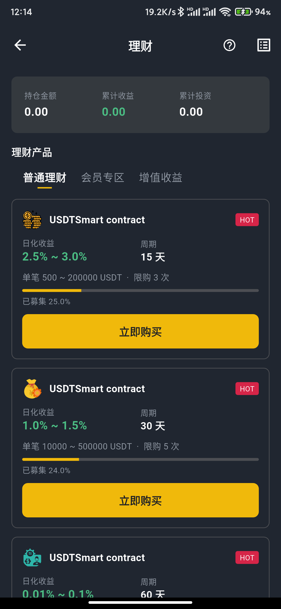

<sub>理财：普通理财 / 会员专区 / 增值收益三个分区，产品卡片含日化收益、周期、单笔额度、限购次数与募集进度。</sub>

### 四、账户与安全

- **注册 / 登录 / 找回密码**：App 端具备完整的独立注册能力，无需再跳转网页。
- **实名认证、邮箱认证、银行卡、条款协议、VIP 等级、在线客服**全部原生化。
- 网络层启用 **HTTPS + HTTP/2**，接口响应更快；异常信息不外泄，登录态失效即时识别并安全跳转。

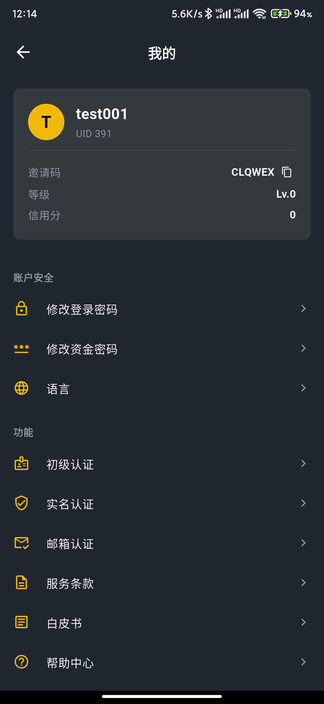

<sub>"我的"：账户卡片（UID / 邀请码 / 等级 / 信用分）+ 账户安全（登录密码、资金密码、语言）+ 功能区（初级认证、实名认证、邮箱认证、服务条款、白皮书、帮助中心）。</sub>

### 五、运营可配置

平台后台即可控制 App 的呈现，无需发版：

- **底部导航 Tab、首页服务宫格、"我的"菜单、资产页 Tab** 均由后台配置驱动；
- 公告、帮助中心、下载中心、白皮书、推广中心内容后台可维护；
- **邀请码深链归因**：用户通过推广链接安装 App 后，邀请关系自动带入，代理推广体系在 App 上完整延续。

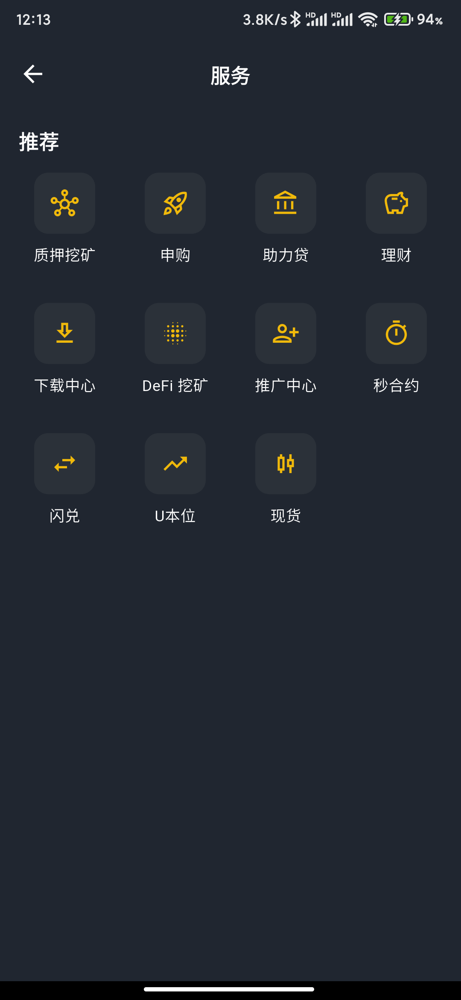

<sub>服务中心：质押挖矿、申购、助力贷、理财、下载中心、DeFi 挖矿、推广中心、秒合约、闪兑、U 本位、现货——这一整页的入口数量与排序，全部由后台配置决定，上下线功能无需重新发版。</sub>

### 六、多语言

内置 **7 种语言**：简体中文、繁体中文、英语、日语、韩语、越南语、泰语。语言列表由后台控制，可按运营区域开关。

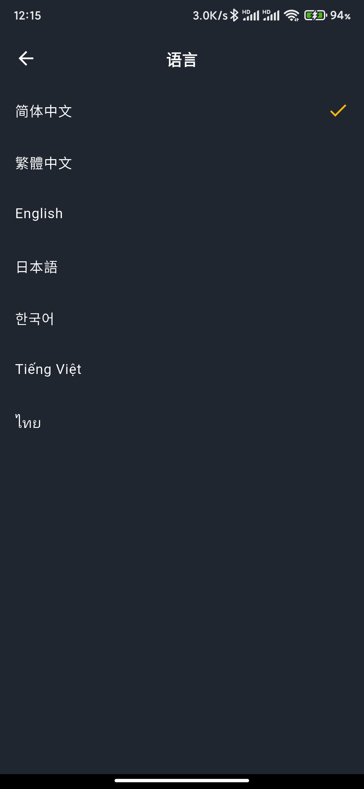


#  更新日志 (Changelog)

### V6.3.0  - 2026/8 

- 行情与 K 线：接入 TradingView 专业图表，多周期切换、指标齐全；行情价格实时推送，K 线顶部报价已做到秒级更新
- 引入行情陈旧保护——数据源异常时不再采信过期价格
- 秒合约：下单 → 倒计时 → 自动结算全链路原生，倒计时以服务端定盘时刻为唯一基准，所见即真实结算时点
- U 本位永续合约：划转、开仓、持仓、平仓，市价/限价、盘口十档、实时盈亏一屏可见
- 币币现货 与 闪兑：两种交易方式并行，适配不同习惯的用户
- **TradFi（外汇 / 商品 / 股票 / 指数）**：在传统金融品类上提供与数字资产一致的交易体验，行情页优先呈现，品类 Tab 可由平台后台自由配置
- 资产总览、账户分布（现货 / 合约 / 理财分账户一目了然）、划转、充值、提现、充提记录、资金流水，**全部原生化**
- 充值页按币种正确标识 TRC20 / ERC20 / BEP20 等网络，从源头避免充错链
- 资产页完整展示全部持仓币种，金额显示统一优化：去掉冗余小数位，同时保留小额资产精度
- 理财（三分区）/ 质押 / DeFi / 助力贷 / 挖矿 全部原生页面
- 申购（打新）：项目列表、认购、订单与状态流转全流程原生
- 跟单 / 带单：输入跟单码一键跟投，带单员发码带单，全流程系统托管
- 注册 / 登录 / 找回密码：App 端具备完整的独立注册能力，无需再跳转网页
- 实名认证、邮箱认证、银行卡、条款协议、VIP 等级、在线客服全部原生化
- 网络层启用 HTTPS + HTTP/2，接口响应更快；异常信息不外泄，登录态失效即时识别并安全跳转
- 行情推送链路重做：连接状态实时自检、断线自动恢复，价格更新稳定连续
- 盘口挂单量按价格档位与真实量级重建，数据实际市场形态
- 合约、秒合约、TradFi 订单的分页、历史口径与币种名目全面对齐
- 整体视觉按主流交易所标准重做；时间、金额、小数位显示全局统一
- 每一轮迭代均在真实 Android 设备上逐屏验证后才发布
- 内置 7 种语言：简体中文、繁体中文、英语、日语、韩语、越南语、泰语。语言列表由后台控制，可按运营区域开关。
- APP 技术栈:  Flutter 跨平台原生技术路线


### V6.2.0  - 2026/8/18

- 新增原生APP ，包含安卓和 IOS 平台，Flutter 
- 运营后台新增 资产Tab设置
- 资产总览加「账户分布」，优化平台资产/ 理财资产 / 合约账户
- 原生 APP 重写 K线盘口

### V6.1.2  - 2026/8/2

- 新增玩法 —— 跟单码交易

- 用户端体验 优化—— 资产精确小数点、理财、合约下单、多语言

### V6.1.0 - 2026/7/20

- 支付与入金优化 ——
  新增数字资产入金通道、专属地址、下单式充值、链上实收自动到账、网络标识修正 →
    入金全自动闭环 + 双通道容灾

- 资金安全 —— 全面安全审计与加固：账户接入、资金原子化、权限边界、重复发放防护、密
  钥治理、账号防护

- 交易稳定性 —— 行情失真防护、重复结算防护、订单不悬挂、倒计时对齐、横向扩展就绪 

### V6.0.6 - 2026/6/15

- 入金新增 **TokenPay** 支付网关（后台与优盾二选一），支持每用户分配独立充值地址，自动归集指定冷钱包

### V6.0.6 - 2026/6/14

- 优化 H5 充值页 `recharge-apply-udun`

### V6.0.5 - 2026/6/5

- 优化币币NPE和Redis Stream消费者组逻辑

### V6.0.4 - 2026/5/20

- 当前持仓数据显示优化
- 多语言显示问题修复
- dapp 接口关闭
- K 线socket 请求方式更新
- 涨跌幅数据显示优化

### V6.0.3 - 2026/5/8

- PC 合约订单优化
- 优盾充值参数 优化

### V6.0.1 - 2026/4/1

[重构大升级] - 2026-04

本次升级主要针对系统安全性、资金一致性及基础架构稳定性进行全方位重构，分为四个阶段逐步实施。

> 重点修复登录链路、越权访问及资金回调等高危风险。

- **[认证安全]** 修复登录与账户接管链路：钱包地址登录强制增加 `challenge` 签名校验，彻底禁止“仅凭地址登录”。
- **[权限控制]** 对象级授权（IDOR/BOLA）加固：对仓位、止盈止损、银行卡、后台审核/调账/KYC 等接口统一增加“资源归属校验 + 角色范围校验”。
- **[后台安全]** 封堵高危越权漏洞：针对充值/提现审核、调账、改密、拉黑、代理归属等操作，增加团队边界、审批链及不可越权的强校验。
- **[2FA 修复]** 处置 2FA 密钥泄露风险：下线匿名可访问的二维码/密钥接口，并完成历史密钥轮换。
- **[资金安全]** 强制化资金回调验签：充值/提现回调接口增加签名校验、时间窗校验及 `nonce` 防重放机制，校验失败直接拒绝。

> 聚焦资金流转的幂等性、事务一致性及敏感数据处理。

- **[资金状态机]** 实现全链路幂等化：覆盖充值、提现、退款、结算、划转流程，引入幂等键与状态 CAS 机制，杜绝重复入账/退款/派奖。
- **[事务改造]** 提升事务一致性：将内部划转、结算、审核等资金动作改造为单事务或可靠补偿事务，防止中间态数据失衡。
- **[凭据治理]** 强化密码安全策略：移除 `123456` 等默认弱口令，改密接口强制绑定当前登录主体。
- **[日志脱敏]** 接入统一脱敏中间件：禁止打印 raw body、sign、证件号、手机号、地址及密钥等敏感信息。
- **[防重设计]** 前端高危操作防重：针对提现、下单、审核、保存等操作实施“按钮锁 + 服务端幂等”的双重防重复机制。
- **[URL 整改]** 敏感参数传输整改：禁止通过 URL 传递提现金额、2FA、验证码、密钥等敏感参数。

> 优化密钥管理、Web 漏洞防护及运行环境稳定性。

- **[密钥管理]** 体系升级：移除配置与代码中的硬编码密钥，全面迁移至专业的密钥管理服务。
- **[XSS 治理]** 富文本安全防护：在公告、帮助中心、站内信等入口启用内容净化、输出编码与 CSP 策略。
- **[SSRF 防护]** 治理不安全 HTTP 工具：实施目标地址白名单机制，禁用 `trust-all SSL`，补齐证书与主机名校验。
- **[依赖治理]** 建立 SBOM 组件清单：升级高危依赖，移除高风险的 `system-scope` 本地 jar 包。
- **[稳定性]** 优化邀请码生成逻辑：将 `while(true)` 改为有限重试 + 兜底方案，避免高并发场景下的性能衰减。
- **[环境隔离]** 强化配置隔离：增加启动时环境校验，防止 dev 配置串用至生产环境。

> 针对前述修复内容进行最终的可行性与残留风险验证。

- **[Druid 监控]** 验证监控台公网暴露与默认口令风险是否已彻底消除。
- **[XSS 验证]** 确认富文本存储型 XSS 漏洞是否已无法稳定触发。
- **[链路验证]** 验证 SSRF/LFI/MITM 工具链是否已阻断实际可利用路径。
- **[漏洞可达性]** 验证当前运行路径下的依赖漏洞是否可达（需进行可达性验证）。

---

# TODO

**自建钱包归集**

- 支持主地址资产展示。
- 支持子地址池、已分配地址、待归集资产和地址余额查看。
- 支持单地址归集、批量归集和补充 Gas。
- 支持查看用户关联地址和链上浏览器跳转。


## 打赏

如果该项目对您有所帮助，希望可以请我喝一杯咖啡☕️

```bash
# USDT-TRC20打赏地址:
TTz4y9EE5DqtRAneK5iQtWNW4k9E888888
```


## 声明

源码仅用于学习交流使用！

不可用于任何违反中华人民共和国(含台湾省)或使用者所在地区法律法规的用途。

因为作者即本人从未参与用户的任何运营和盈利活动。 

且不知晓用户后续将程序源代码用于何种用途，故用户使用过程中所带来的任何法律责任即由用户自己承担。            

```
！！！Warning！！！
项目中所涉及区块链代币均为学习用途，作者并不赞成区块链所繁衍出代币的金融属性
亦不鼓励和支持任何"挖矿"，"炒币"，"虚拟币ICO"等非法行为
虚拟币市场行为不受监管要求和控制，投资交易需谨慎，仅供学习区块链知识
```

